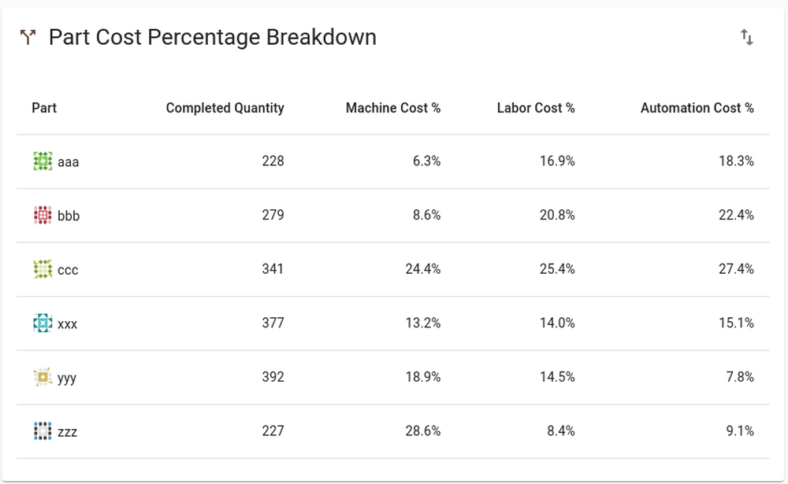

# FMS Insight Monthly Cost/Piece Page

Cost-per-piece is a great [metric](improve-fms) for scheduling, operations
management, future capital purchases, quoting work, accounting, and
budgeting. The cost/piece tab is largely intended to serve as a
verification that flexibility and operational changes are reducing part
costs; you can compare part costs from before a change to after a change to
understand if the change improved the system.
Indeed, FMS Insight has a narrow view of just the cell itself and does not
take into account any overhead or other costs. Therefore, for budgeting,
quoting work, and other management decisions, we suggest that you export the
cost breakdown or workorder data to your ERP and implement
a cost report in your ERP taking into account all factors.

Cost/piece is not a great metric to use initially when searching for techniques
to improve the cell's operation, since
focusing only on cost/piece risks introducing quality problems and OEE
reduction. Instead, cost/piece is a great metric to use after-the-fact to determine
if an implemented change in production operations has had a meaningful impact on
cost/piece.

## Cost Breakdown

Calculating cost-per-piece requires splitting large fixed costs such as machine depreciation and
labor across the parts that were produced. To do so, we use a monthly analysis window of the
actual operations together with the planned use of resources to determine a percentage breakdown
of the cost for each part.

To do so, consider that the system produces two part types, aaa and bbb,
and aaa has a planned cycle time of 3 hours and bbb has a planned cycle time of 2 hours.
For January we collect data on the total number of parts produced by the system. Consider that
in January the system produced 400 aaa parts and 500 bbb parts. We then calculate the cost breakdown
as follows. Since we produced 400 aaa parts, those aaa parts should have used 400\*3 = 1200
machine-hours. Similarly, the bbb parts should have used 500\*2 = 1000 hours. Thus, aaa used `1200 / (1000 + 1200) = 54.5%` of
the planned hours and bbb used `1000 / (1000 + 1200) = 45.5%` of the planned hours.
Similar calculations happen for labor and automation.

From a cost perspective, any bottlenecks or utilization slowdowns should be viewed as system
problems and all parts are responsible for a portion of this cost. Indeed, The cost-per-piece
metric is an actionable insight for quoting orders and justifying future capital investments and for
these purposes any OEE problems are a problem for everything produced by the system. The above
method does this by using planned cycle times to divide the total machine cost (which includes
active and idle time) among the parts produced during the month based on their weights. A quick
calculation of machine utilization gives `(1200 + 1000) / (24*30*4) = 76%` use. The above method
divides the 24% of the time the machine is not in use among aaa and bbb based on their percentages
of planned use. Attempting to identify OEE problems are better addressed using the
[efficiency tab](client-flexibility-analysis).

The data can be copied to the clipboard via the two-arrow-icon button in the top right.

## Part Cost/Piece

Once the percentage breakdown for each part is calculated, the webpage allows you to
enter the total machining, labor, and automation cost for the period. This value
is then multiplied by the above cost breakdown percentages to get a total cost per
piece. As mentioned above, we suggest that you copy the above cost breakdown percentages
into your own spreadsheet or ERP system to be able to account for overhead, overtime,
material costs, and other costs not visible to FMS Insight.

