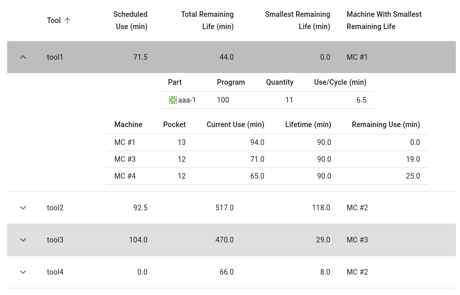

# FMS Insight Tools & Programs Page

The tools and programs report are accessible from two different places; first, the reports are available
on the [Operations Management Page](client-operations) so that the floor supervisor can view information
about the tools and programs along with the other metrics and data for day-to-day management. Second,
just the tools and programs reports tables are available on a dedicated page accessible from the
initial [launch page](client-launch). This page is intended for display in the tool-room or elsewhere
on the shop floor where tools are managed. We suggest that this page is bookmarked and directly opened.

## Tool Report

The current tool use and life from each machine is loaded by clicking the "Load Tools" button. The data
can be refreshed by clicking the circular icon in the top bar.

The main table shows a summary of all tools across all machines. For each tool, the table shows columns
for:

- _Scheduled Use_: This column sums over all not-yet-machined currently scheduled parts, using the estimated
  tool use that is calculated for each program. (The calculated tool-use per program can be seen on the program
  report.) Note that if a program is currently-executing, we don't know where in the program it is so
  the _Scheduled Use_ column contains the entire calculated tool-use for the program.

- _Total Remaining Life_: This sums the remaining life of the tool over all machines.

- _Smallest Remaining Life_: These two columns show the machine and amount with the smallest remaining life.

A scheduled part might be routed to several machines so we don't know ahead of time which tool will be used.
Instead, you should compare the scheduled use with the total life and the smallest remaining life to get a
sense of if additional tools will be needed soon.

For each tool, details about the individual pockets and scheduled parts are available by clicking the
arrow at the beginning of the row. The parts table shows all scheduled parts, the program, the remaining quantity
to run, and the estimated use per program. The machines table shows the pocket number or numbers containing the
tool and the current use and remaining life.

## Program Report

The current programs in the cell controller are loaded by clicking the "Load Programs" button. The data
can be refreshed by clicking the circular icon in the top bar.

The main table shows the following columns:

- _Program Name_
- _Cell Controller Program Name_: this column will only appear if the cell controller uses a name or number
  different from the program name.
- _Part_: the part and process number that uses this program.
- _Revision_: this shows the program revision, but will only appear if program revisions are used as part of
  a downloaded job. If revisions are not used, this column will not appear.
- _Median Time and Deviation_: For the [flexibility analysis](client-flexibility-analysis), FMS Insight
  uses the data from the last 30 days to calculate a statistical median and deviation running time for each
  program. Because times above the median (likely due to program interruptions) is a different probability
  distribution to times below the median (likely due to normal Gaussian noise), we calculate deviations
  of the two separately.

In addition, the buttons on the end of the row allow viewing the program content. If revisions are used, the
history of old revisions of the program can also be seen.

The arrow at the beginning of the row shows the calculated tool data for this program. We take the last 5
executions of the program which are within the standard deviation of the median, and from those 5 executions,
calculate the average (mean) tool use. If a tool is changed during one of these cycles, we can't calculate the actual usage
so that cycle is not included in the average.
